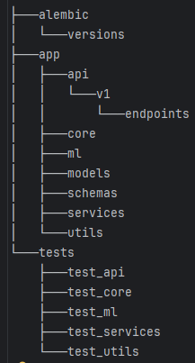

## Архитектура проекта
[Описание: бэкенд на Python + БД, запуск через Docker, слои: API → сервисы → репозитории]

---

## Эндпоинты API (основные)
- `GET /api/tasks/` — список задач
- `POST /api/tasks/` — создать задачу
- `GET /api/tasks/{id}/` — детали задачи
- `PUT /api/tasks/{id}/` — обновить задачу
- `DELETE /api/tasks/{id}/` — удалить задачу

---

## Документация Swagger
Ссылка на Swager